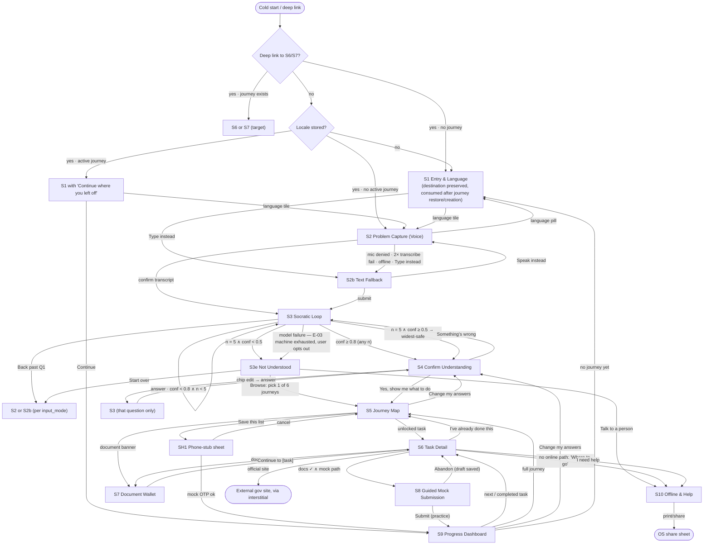

# Batch 1

Answers recorded as `USER` decisions (explicit option picks, not `DEFAULT (assumed)`): **Q-A = A** (seeded-state picker, Assam canonical), **Q-B = A** (backend persists journey + answers; wallet on-device), **Q-C = A** (S1 renders with Continue option). One parameter inside Q-A was left to the author — the second seeded state — set to **Maharashtra** and logged as `DEFAULT (assumed)` in D9.

---

# D1 — Change Log & Resolution Summary

**Legend.** *Behavior changed* = the resolution alters something the original spec affirmatively stated, rather than filling a gap. Gap fills are marked **No**; every **Yes** row is an intent change per Authoring Rule 4.

| ID | Sev | Resolution applied | Closed in | Behavior changed |
|---|---|---|---|---|
| P0-1 | P0 | Complete S3 exit machine: `conf ≥ 0.8 → S4` (any n); `conf < 0.8 ∧ n < 5 →` next question; `n = 5 ∧ conf ≥ 0.5 → S4` widest-safe; `n = 5 ∧ conf < 0.5 → S3e`. All three artifacts state this one machine. | D2 §2.2, §2.3; D3 §S3 | No — new rule derived from the stated "never return nothing" principle; diagram/table corrected to match |
| P0-2 | P0 | Returning user, stored locale + active journey → S1 renders with "Continue where you left off" → S9 (per Q-C). Auto-skip transition row deleted. Stored locale, **no** journey → skip to S2 (original D1 intent retained; language pill in S2 remains the locale escape). | D2 §2.2 (D1 node); D3 §S1 | **Yes** — the "skip to S9" transition row is deleted; one of three conflicting behaviors was chosen |
| P0-3 | P0 | Full T1 schema authored: 4 ordered steps, every field with label, "why we ask" line, type, validation, wallet pre-fill source. Models **Assam** (CRS Form 2 basis) per Q-A. | D3 §S8 + Appendix A (Batch 3) | No — content that was always required, now specified |
| P1-1 | P1 | Diagram and decision table regenerated from screen specs: S3e `retry → S4` arrow removed; S4 "Something's wrong" → S3-Q1; D2 (permission) restated as an in-S2 branch, not a pre-S2 gate. | D2 §2.2, §2.3 | **Yes** — three artifact-level routes deleted/corrected |
| P1-2 | P1 | S3 Error state: silent retry ×1 (same 6 s timeout) → visible retry card → after 2 failed visible retries, card adds "Browse common situations instead" → S3e. Copy in D5. | D3 §S3; D5 E-03 | No |
| P1-3 | P1 | S8 success auto-adds the watermarked mock output document to the wallet. "I've already done this" → prompt "Do you have the [document]? Add it now / I'll add it later." | D3 §S6, §S8; D4 §4.2 | No |
| P1-4 | P1 | Recompute diff: one-line summary + "See what changed" expander; removed-completed tasks archive under "No longer needed," never deleted; Q1 No→Yes renders T1 pre-completed + certificate add-prompt (P1-3 pattern). | D3 §S4, §S5, §S9; D4 §4.4 | No — implements P5's stated "never silently discarded" |
| P1-5 | P1 | Q2 picker constrained to seeded states (Assam, Maharashtra) per Q-A. Unseeded selection impossible; picker shows "More states coming — for now we cover Assam and Maharashtra" beneath the two options, with "My state isn't here" → S10 (national helpline content). | D3 §S3 (Q2), §S10 | **Yes** — original implied a full searchable 28+ state picker |
| P1-6 | P1 | Phone-stub specced as shared modal sheet **SH1**: layout, "Enter 0000 — this is a practice code" labelling, invalid-number and wrong-OTP inline errors, resend, full five-state coverage. | D3 §Shared Components (SH1) | No |
| P1-7 | P1 | Per Q-B: backend persists journey + answers keyed to the stub; wallet never syncs (P3). Device 2 restores journey; doc-gated tasks show "Documents stay on the device they were added to." | D3 §S9; D4 §4.3 | No — scopes a stated but unscoped capability |
| P1-8 | P1 | Dynamic a11y rules: named focus target + `aria-live` announcement pattern for S3 question advance, S4 return-from-edit, S5/S9 recompute and unlock, SH1 open/close, S8 validation. | D6 §6.2 | No |
| P1-9 | P1 | S3e browse list specced: 6 named journeys (from the T1–T9 model), card anatomy, states; manual selection lands on S5 with "Based on a common situation — check it fits you" banner replacing S4 confirmation. | D3 §S3e | No |
| P2-1 | P2 | RTL layout rule (general case per Register Q6) + locale format tokens (`{date_format}`, `{number_format}`); S8's hardcoded "12-03-2024" replaced by token-driven example. | D6 §6.4; D3 §S8 | No |
| P2-2 | P2 | Each S3 question is a distinct history entry; browser back mirrors in-app back (N3). | D3 §S3; D2 §2.4 | No |
| P2-3 | P2 | `In progress` chip ⇔ a saved S8 draft exists for that task; cleared on submit or explicit draft discard. | D3 §S5; D4 §4.2 | No |
| P2-4 | P2 | Mic gesture: release < 300 ms after press = tap-to-toggle; ≥ 300 ms = hold-to-talk; first detected gesture sets session mode. | D3 §S2 | No |
| P2-5 | P2 | S2 rows added: permission revoked mid-session → stop, preserve partial transcript, show re-enable instructions; call/app-switch → auto-stop, preserve partial transcript. | D3 §S2 | No |
| P2-6 | P2 | "Reconcile on reconnect" deleted. Mock submit completes locally regardless of connectivity (nothing is transmitted); offline chip stays visible; S9 Waiting list scoped to simulated government processing only. | D3 §S8; D4 §4.5 | **Yes** — original stated queue-and-reconcile |
| P2-7 | P2 | Submit disables on first tap; exactly one mock ack number per draft (idempotent on draft ID); repeat taps are no-ops. | D3 §S8; D4 §4.5 | No |
| P2-8 | P2 | Document removal never reverts completion; affected completed tasks show an informational note ("Completed earlier — removing the document doesn't undo this"). | D3 §S7; D4 §4.4 | No |
| P2-9 | P2 | Deep-link target consumed immediately after journey restore; target absent from journey → S5 with notice "That step isn't part of your journey." | D2 §2.2; D3 §S6, §S7 | No |
| P2-10 | P2 | S6 CTA rule: mock exists → "Start this step (practice)"; online path, no mock → "Take me to the official site"; neither → primary CTA "Where to go" → S10. D7 corrected accordingly. | D3 §S6; D2 §2.3 | **Yes** — D7's `false → S10` route replaced by an explicit CTA rule; "hide entirely" refined to "replace" |
| P2-11 | P2 | S10 states table: offline (cached data, map link disabled, address shown), non-telephony device (copyable number), share unavailable (print-view fallback). | D3 §S10 | No |
| P2-12 | P2 | Multi-tab: last-write-wins; `storage` event shows a "This page was updated in another tab — Refresh" banner in the stale tab. | D4 §4.5 | No |
| P2-13 | P2 | S1 re-entry from language pill renders a "Back to your question" affordance, an explicit N1 exemption. | D3 §S1, §S2 | No |
| P2-14 | P2 | New screen **S11 — What's real and what's mocked** (required by C7; Rule 5 declaration): global footer entry on every screen, mocked-dependency list format. | D3 §S11 (Batch 3) | No — realizes an existing C7 requirement |
| Matrix-only gaps | — | S1 audio-preview failure (fail quiet + "Audio unavailable" note); S3 inputs disabled while thinking; S3 voice "Did you mean…" capped at 1 re-render then tap-only; S6 Loading skeleton; S7 upload-failure + camera-denied rows; S8 prefill Loading. | D3 (respective screens) | No |

**New artifacts declared:** screen **S11** (rationale: C7 mandates it; no existing screen hosts it), shared sheet **SH1** (not a screen; modal component invoked from S5 and S9).

---

# D2 — Flow Architecture

## 2.1 Node inventory

Screens: S1, S2, S2b, S3, S3e, S4, S5, S6, S7, S8, S9, S10, S11. Shared modal: SH1 (phone-stub sheet). Every screen carries the global footer (→ S11) and the persistent disclosure banner; these are omitted from the diagram edges for legibility but stated in §2.4.

## 2.2 Flow diagram

## 2.3 Decision node table (corrected, authoritative)

| Node | Condition | True path | False path |
|---|---|---|---|
| D1 | Locale stored | Active journey → S1 with Continue option; no journey → S2 | S1 |
| D2 | Mic permission granted on first mic tap **(in-S2 branch, not a gate before S2)** | S2 voice capture proceeds | S2b, with "typing works just as well" note |
| D3 | S3 exit machine | `conf ≥ 0.8` → S4 · `conf < 0.8 ∧ n < 5` → next question · `n = 5 ∧ conf ≥ 0.5` → S4 (widest-safe) · `n = 5 ∧ conf < 0.5` → S3e | — (machine is total; no other case exists) |
| D4 | User confirms S4 summary | S5 | "Something's wrong" → S3 at Q1, answers retained |
| D5 | Task prerequisites complete | S6 unlocked | S6 locked (read-only if deep-linked) |
| D6 | All required documents in wallet | Proceed per D7 | S7 |
| D7 | Submission path for this task | Mock exists → S8 · online path, no mock → external site via interstitial | Neither → primary CTA "Where to go" → S10 |

## 2.4 Back-navigation map (in-app Back; browser/hardware back mirrors it per N3 — every screen and every S3 question is a distinct history entry)

| Screen | Back target |
|---|---|
| S1 | None (N1). Exception: re-entry via S2 language pill renders "Back to your question" → S2 with text intact |
| S2 | S1 |
| S2b | Originating screen (S1 or S2) |
| S3 | Previous question, answer pre-selected; from Q1 → S2 or S2b per `input_mode`, transcript intact |
| S3e | Last S3 question |
| S4 | Last S3 question answered |
| S5 | S4; if journey was manually selected via S3e → S3e |
| S6 | S5 |
| S7 | Originating screen (S6 or S5) |
| S8 | Previous form step, data retained; from step 1 → S6, draft saved |
| S9 | S5 (journey exists); S1 (no journey) |
| S10 | Originating screen (S5, S6 or S3e) |
| S11 | Originating screen |
| SH1 | Dismiss → originating screen (S5 or S9), no data loss |

**Integrity check:** every node above has ≥ 1 inbound and ≥ 1 outbound edge; EXT and OS are terminal by design and are exits, not dead ends (interstitial and share sheet both return on dismiss). No orphan exists: S11 is inbound-reachable from every screen via the global footer; S10 is inbound from S3e, S5 (locked-task expander help), S6, and S9's help affordances.
